# Eindproject-API

**Gemaakt door:** Mehmet Demirtas  
**Studentnummer:** r0939369

## Over het thema

Mijn FastAPI project gaat over users (email en wachtwoord), locatie van de users en de items van de users.

## De eisen dat ik heb gedaan:
### Algemene eisen

- Minstens 3 GET, 1 POST, 1 PUT en 1 DELETE endpoints
- Minstens 3 entiteiten in je API via een SQLite databank
- Minstens hashing en OAuth implementeren
- Beschrijving van het gekozen thema, je API(s) en je uitbreidingen + link naar de zaken die hosted zijn op GitHub README.md
- Aantoonbare werking totale API door screenshots van Postman requests op GitHub README.md
- Volledige OpenAPI docs screenshot(s) op GitHub README.md
- Logisch gebruik van path parameters, query parameters en body
- Test alle GET endpoints van een van je APIs via de Requests en pytest library met een testfile in de root van je repository.

### Aanvulling functie
- Test alle niet-GET endpoints.

### Aanvulling: front-end
- Maak een front-end voor je applicatie die al je GET endpoints en POST endpoints bevat. 
    - Host de front-end op Netlify. 
    - Geef de front-end een leuke stijlgeving.

## Overvieuw FastAPI-Documentatie
[Click here](img/img.png)

## front-end hosted on netlify (het bevat alleen get-endpoints)
[https://65945fd5e4b44f02dfecff8d--guileless-sawine-851085.netlify.app/](https://65945fd5e4b44f02dfecff8d--guileless-sawine-851085.netlify.app/)

## Postman
- I just made a user with email: **test** and password: **test**. Also the password gets hashed:
  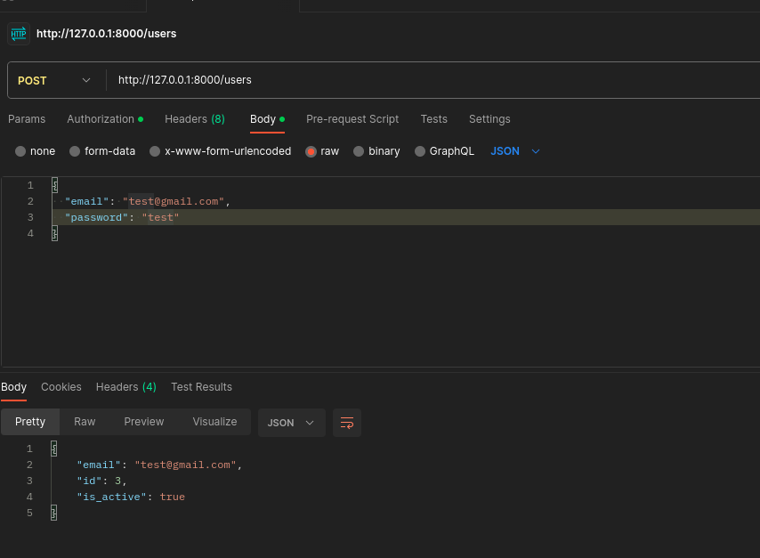
    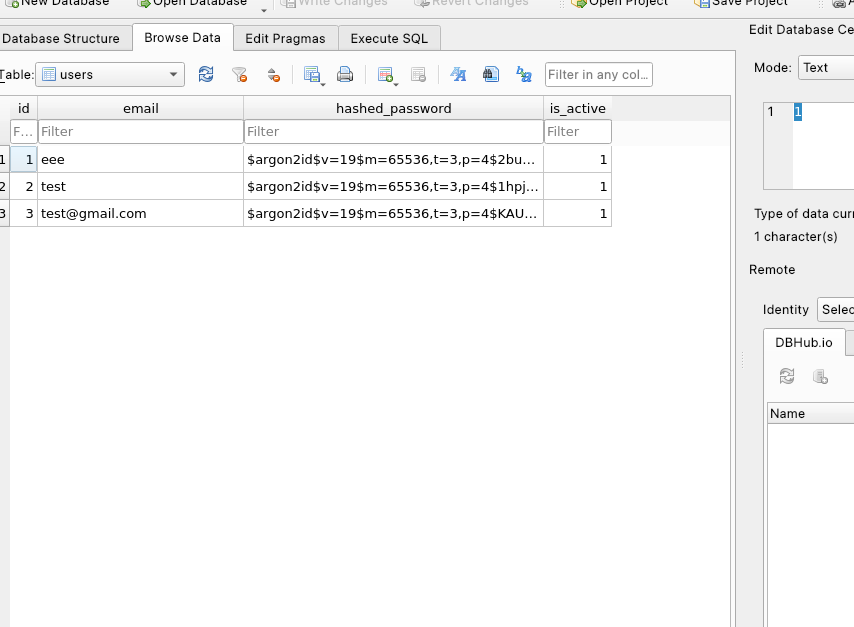
- Now we have a user. let's look at every user in the database:
    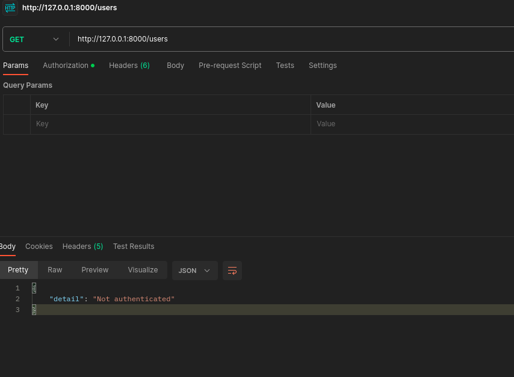
- it doesn't show anything because you need to get authorization. To be authorized we need a token and we can get that by filling our mail and password in the post enpoint of /token:
    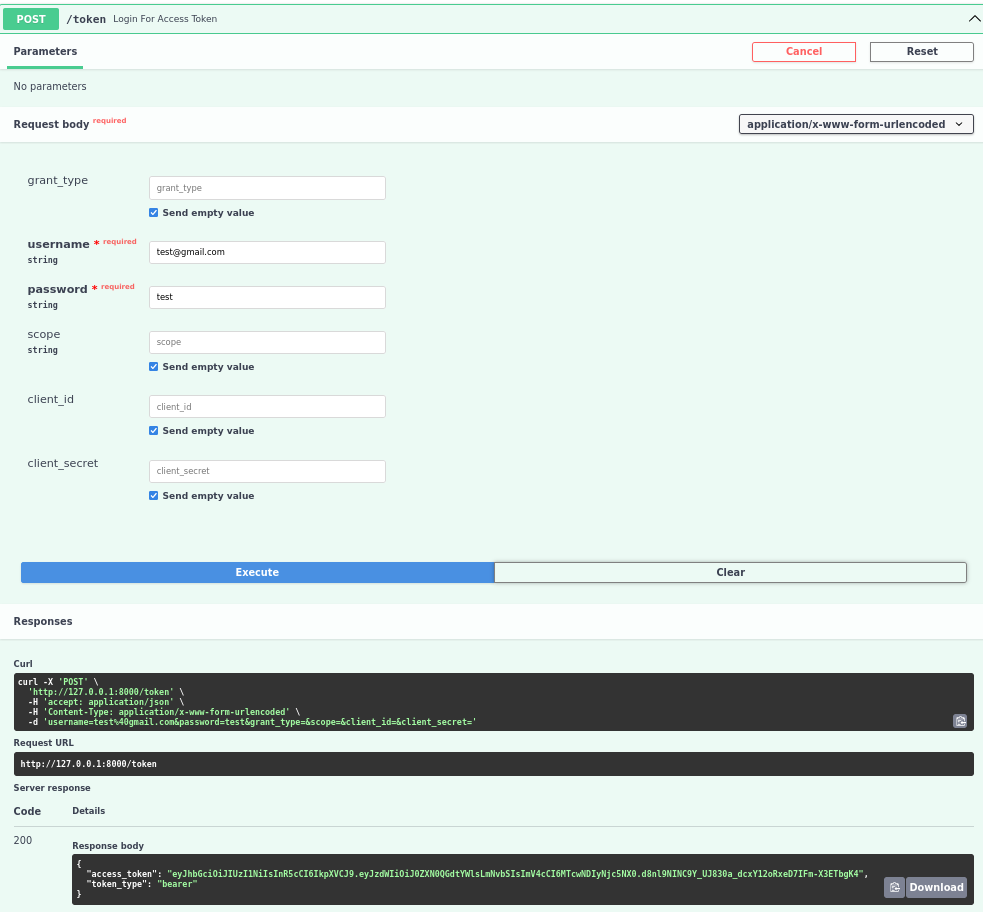
- now that we have the token we can copy it and past it into the postman "authorization section" and if we click send now it will show all the users in the database:
    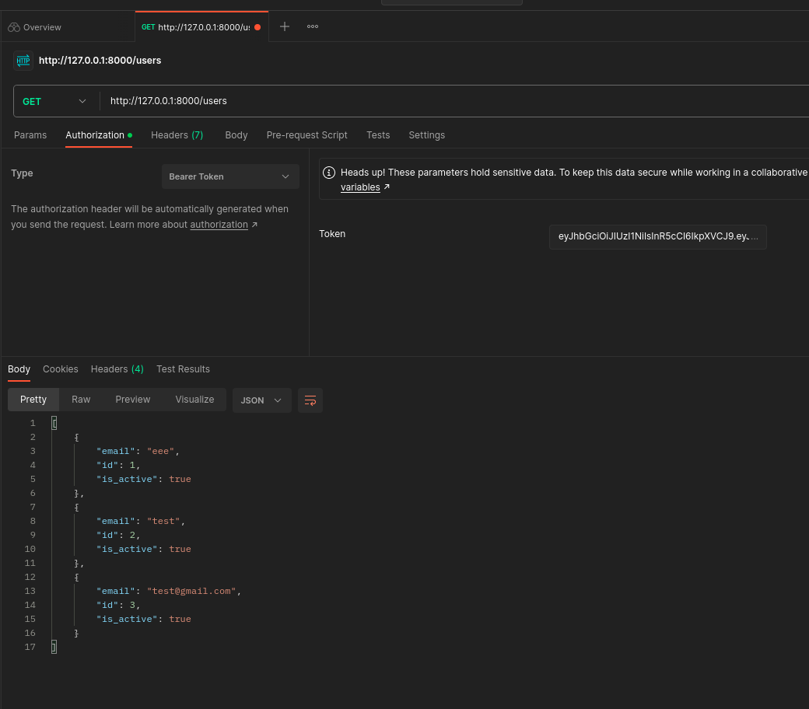
- you can also get specific users just by giving the user_id after "users/" path
    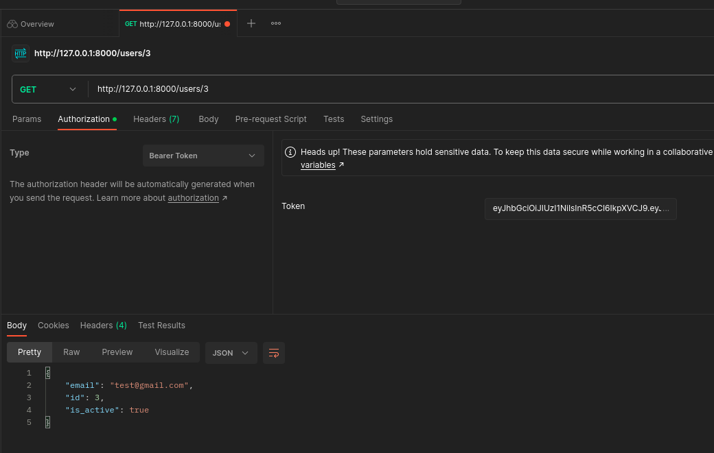
- you can also post items for a specific user:
    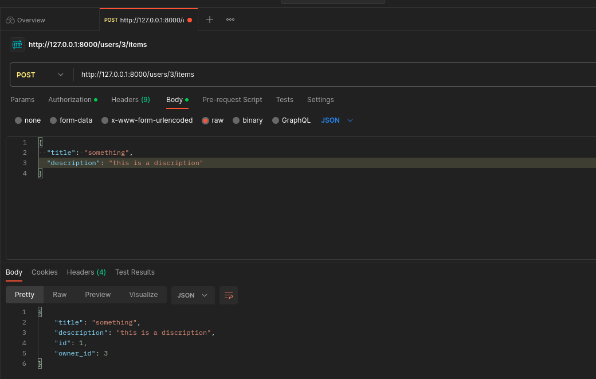
- you can also get all the items you posted (at the moment we just have 1 item):
    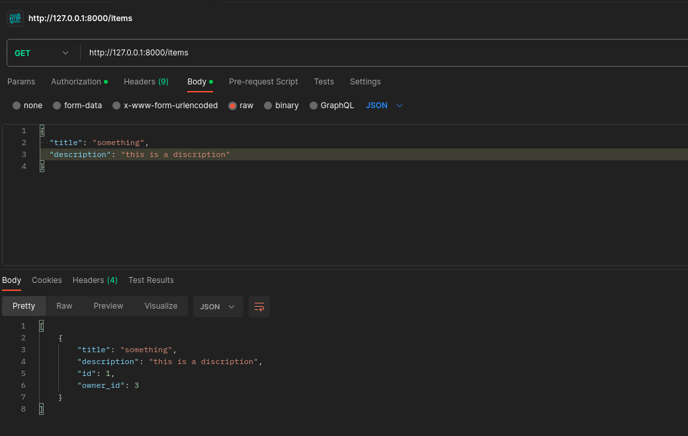
- you can also post location for a specific user:
    
- you can also see all the locations from the users (you have to give the id limit):
    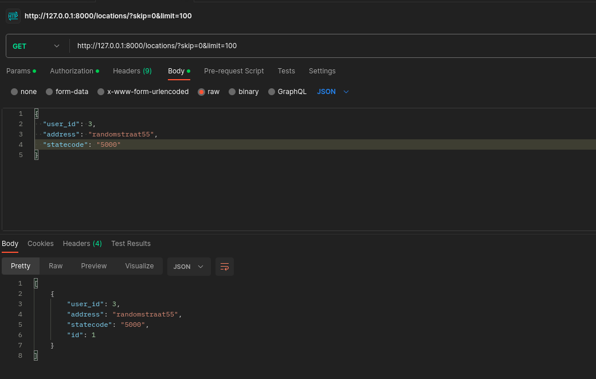
- you can also delete the location just entering the location id:
    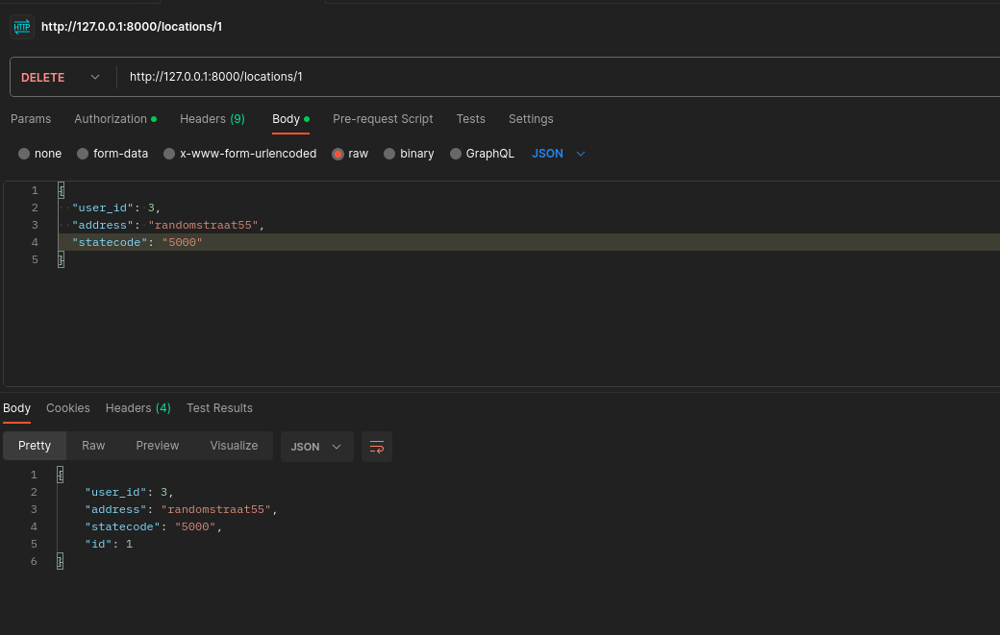
    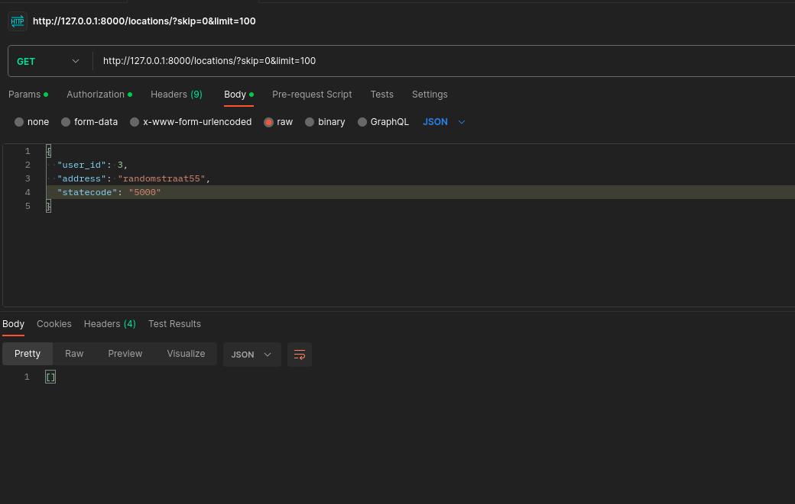
- you can also change the locations value without deleting it using the PUT endpoint:
    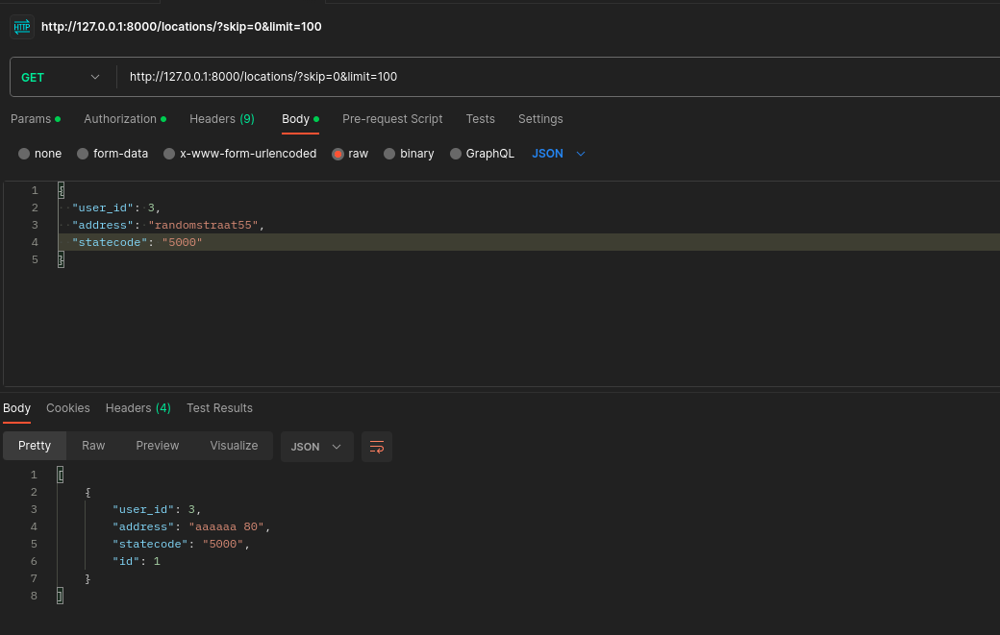
    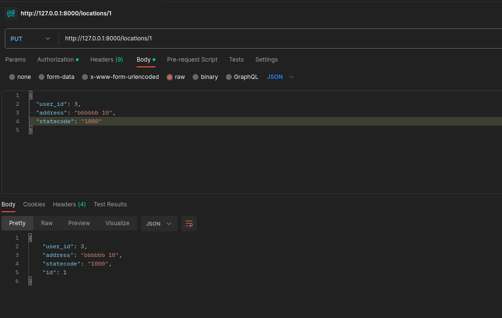
    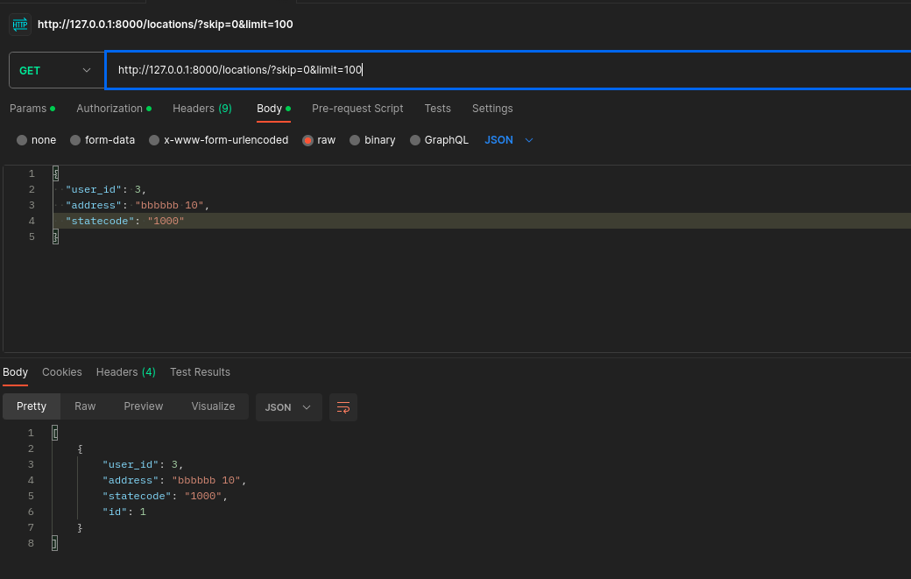

